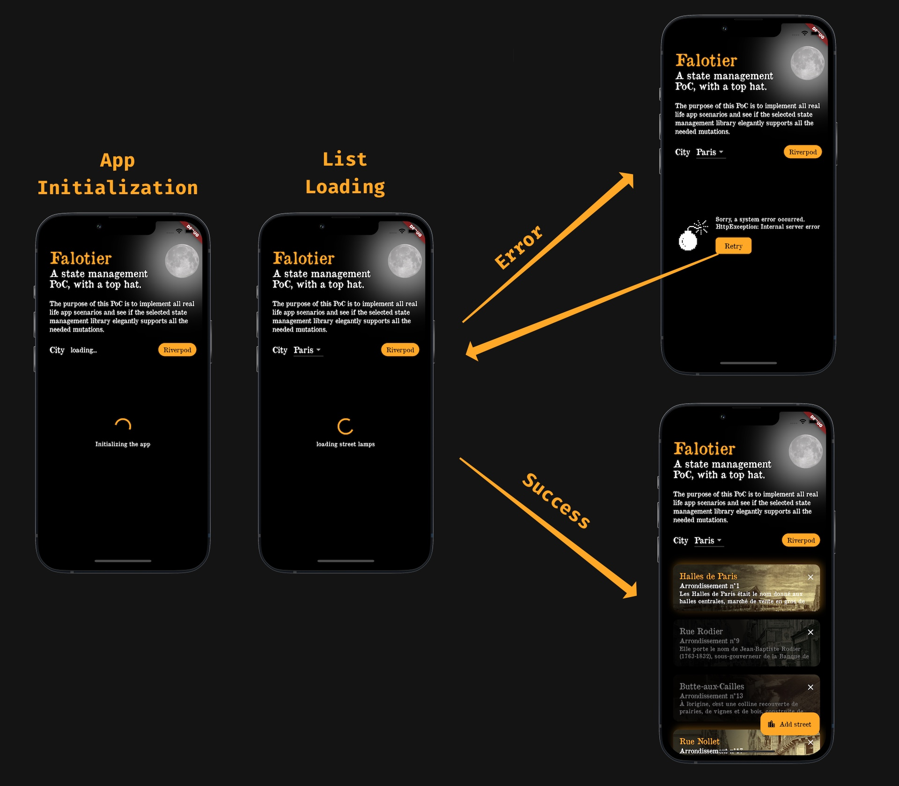
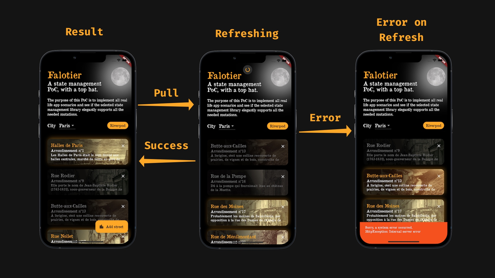
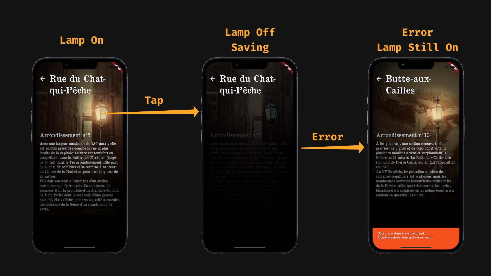

<!-- .slide: data-background-image="Session.png"-->

---

<!-- .slide: data-background-image="Session.png"-->

<video width="1024" height="768" controls>
  <source src="intro_flutter_gorilla.mp4" type="video/mp4">
</video>

---

## [Sharpnado](https://www.sharpnado.com/)

Pragmatic components for the sad real world:

* CollectionView
* Tabs
* MaterialFrame
* MetroLog.Maui
* TaskLoaderView
* GridView with Drag and Drop

---

## 2024 Consulting services

* Best practices training
* MAUI Migration
* App audit and optimization
* Project startup

---

## What is it about?

* Immutability
* State propagation
* Async handling
* Error handling
* TaskLoaderView

----

## MVVM (Presentation)

* Model-View-ViewModel
* data binding and decoupling
  
> What about view model loading and properties mutation ?

----

## Simplified DDD (Business)

* Entities
* Repositories
* Services
* ViewModels
* Views

> What about entities mutation and data retrieval ?

----

## Mvvm.Flux: a state orchestration

All about filling the gaps!
* Coherent UI: the ui reflects the app state
* Coherent updates: the app state is always coherent
* A single source of truth

----

## Mvvm.Flux: principles

* Composition over inheritance
* Single source of truth
* Immutability
* One way data flow

----

## Mvvm.Flux: an implementation

* Composition: `TaskLoaderNotifier`
* Single source of truth: domain layer
* Immutability: `records`
* One way data flow: events/messages

> Let's put it to the test!
---

## Nominal use cases

* Loading from scratch
* Refreshing
* Item update

> Coherent UI: the ui reflects the app state
----

#### Loading from scratch



----

#### Refreshing



----

#### Updating item



---

## Loading from scratch with Mvvm.Flux

* Sharpnado's [TaskLoaderView](https://github.com/roubachof/Sharpnado.TaskLoaderView)
* Stop using `IsBusy=true` and all this nonsense
* Takes our `Task` state and create UI feedback
* Composition over inheritance

----

## IsBusy way in Retronado

```csharp
public override void OnNavigated(object parameter)
{
    _platform = (GamePlatform)parameter;

    Load();
}
```

----

```csharp
private async void Load(bool isRefreshing = false)
{
    IsBusy = !isRefreshing;
    IsRefreshing = isRefreshing;
    HasError = false;
    HasRefreshError = false;
    ErrorMessage = string.Empty;

    ...
```

----

```csharp
    try
    {
        Games = await GetGamesAsync();
    }
    catch (NetworkException)
    {
        ErrorImageUrl = "Sample.Images.the_internet.png";
        ErrorMessage = SampleResources.Error_Network;
    }
    catch (ServerException)
    {
        ErrorImageUrl = "Sample.Images.server.png";
        ErrorMessage = SampleResources.Error_Business;
    }
    ...
```

----

```csharp
    catch (Exception)
    {
        ErrorImageUrl = "Sample.Images.richmond.png";
        ErrorMessage = SampleResources.Error_Unknown;
    }
    finally
    {
        IsBusy = false;
        IsRefreshing = false;
        HasError = !isRefreshing && ErrorMessage != string.Empty;
        HasRefreshError = isRefreshing && ErrorMessage != string.Empty;
    }
}
```

----

## How to reuse code?

* Bad idea: tackle the issue with inheritance
* Good idea: create a component

----

## With TaskLoaderNotifier

```csharp
public TaskLoaderNotifier<List<Game>> Loader { get; }

public override void OnNavigated(object parameter)
{
    _platform = (GamePlatform)parameter;

    // TaskStartMode = Manual (Default mode)
    Loader.Load(_ => GetGamesAsync());
}

```

----

## Loading from scratch

`Retronado` Demo

*Featuring: TaskLoaderView*
----

## Refreshing

`Retronado` Demo

*Featuring: TaskLoaderView*

---

## Updating item

<video width="800" height="600" controls>
  <source src="update-item.mp4" type="video/mp4">
</video>

----

## Updating: bad ideas

* Share a entity by reference between VMs and just modify it
* VM to VM communication

----
## Bad ideas

```csharp
light.IsOn = true;
var updatedLight = await _lightService.Update(light);
_spectacularBus.Send(new UpdatedLightMessage(updatedLight));
```

* What if light instance is shared (caching)?
* What if light is updated in several places?
* How do we handle errors while updating?

----

## Updating item with Mvvm.Flux

* Use records
* Only the domain layer can propagate updates
* Use the `TaskLoaderCommand` to get UI feedback
* Group your UI states with a `CompositeTaskLoaderNotifier`

----

## Updating item with Mvvm.Flux

"Exclusive Lights" Demo

*Featuring: records, CompositeTaskLoaderNotifier*

---

## To take away

* Use `TemplatedTaskLoader` for async loading
* Use `TaskLoaderCommand` for updates
* Send update message from your services
* Use records for entities and the `with` syntax
